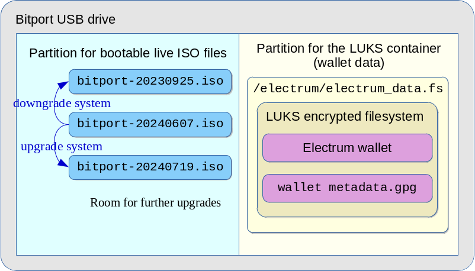

# Bitport - Custom Debian live system for offline Electrum wallets

Bitport is a custom Debian live system designed for Electrum offline wallets.
Electrum offline wallets are stored within a LUKS encrypted volume which is placed in a separate partition from the systems partitions.
Electrum wallets are protected by the LUKS system as well as by the encryption providedd by the Electrum software.

[Debian Live Development Documentation](https://live-team.pages.debian.net/live-manual/html/live-manual/index.en.html)
defines a live system as follows:
> Live system: An operating system that can boot without installation to a hard drive.
> Live systems do not alter local operating system(s) or file(s) already installed on the computer hard drive unless instructed to do so.
> Live systems are typically booted from media such as CDs, DVDs or USB sticks.

So once a Bitport live system is created you cannot change its contents.
If you want to update the system and applications in the live system you can create a new Bitport live system and upgrade the Bitport device to use the new live system.

Bitport has the following features:

+ Bitport system is built as a custom Debian live system available in a bootable ISO-9660 image.

+ You can add the latest Electrum software in the live system without relying on the Electrum package provided by the Debian project.
  This applies to other applications as well.

+ Bitport system is installed in the live ISO multiboot USB drive.

  See [live-iso-multiboot-drive](https://github.com/seedofthespirit/live-iso-multiboot-drive)

+ Installation of the Bitport system is simply to copy the Bitport bootable live system ISO file to the ISO files partition on the multiboot drive.

+ You can install multiple versions of Bitport ISO files in the same multiboot drive.

  To switch between these versions you can just select one of these ISO files at the grub boot loader menu.
  So upgrading the Bitport system is easy.
  If a new version doesn't work you can always revert back to an older working version at the grub menu.

  

+ You can verify authenticity of the Debian Live system via the encrypted checksum.

  The encrypted checksum file is stored separately from the ISO file.
  We provide a script to match up the checksum file against the current live system ISO file to do the verification.

+ Electrum wallet data is secured with a LUKS encrypted volume and stored in a separate partition from the ISO files partition.

+ You can update live system ISO file independently of Electrum wallet data as long as they are compatible.

+ Backing up of the wallet data is easy.

  You can just copy the LUKS container file in the data partition of the working Bitport drive to the data partition of the new Bitport drive.

## Build and Installation

+ [How to build Buitport live ISO file](doc/Build.md)

+ [How to install the generated ISO file](doc/Install.md)

+ [How to use Bitport (with examples)](doc/Usage.md)

+ [Passphrase maintenance, etc.](doc/Maintenance.md)

## References

+ [Official Electrum site with the download and instruction links](https://www.electrum.org)

+ [Debian Live Development Documentation](https://live-team.pages.debian.net/live-manual/html/live-manual/index.en.html)

+ [Debian Live project wiki pages](https://wiki.debian.org/DebianLive)

+ [Debian Live Official images](https://www.debian.org/CD/live/)

+ [live-iso-multiboot-drive](https://github.com/seedofthespirit/live-iso-multiboot-drive)

