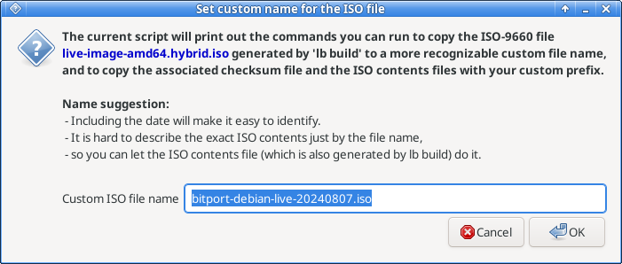
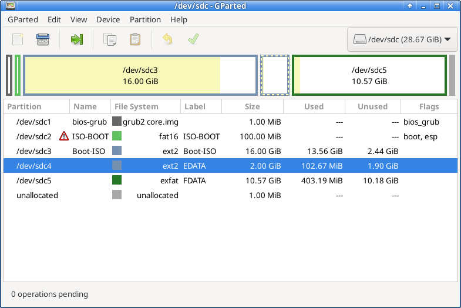

# Install the custom live ISO-9660 image on a USB storage device

## Give custom names to the ISO file and the associated files

The command `lb build` in [the previous Build step](Build.md) generated the ISO file with the name `live-image-amd64.hybrid.iso`,
but this name is a little too generic and later you might not be able to immediately recognize what its contents were when you built it.

So before deploying the ISO file it is better to rename it and its associated files, so that it is easily recognizable.
In this was you can also install and deploy multiple versions of the live systems with their own specific file names.

The command `lb build` generates the following files:
+ `live-image-amd64.hybrid.iso`\
   The ISO-9660 file which will boot the custom Debian live system.
+ `live-image-amd64.files`\
   The contents within the ISO-9660 filesystem.
+ `live-image-amd64.packages`\
   The list of the Debian packages that were used in building the live system.
+ `binary/sha256sum.txt`\
   The list of the sha256 checksums of all files that will be available when the live system is booted and the filesystem is mounted.
   The Debian Live convention seems to be the filesystem is mounted at `/run/live/medium` on the booted live system.

Our script `setup/generate-custom-names-for-iso-and-checksum.sh` will generate the commands you can run
to copy these files to the ones with your custom file names.

Before running the script there is one more consideration.

### Encrypting the sha256 checksum file generated by Live Build

`lb build` generates the sha256 checksum file `binary/sha256sum.txt` and this file is included in the generated ISO-9660 image.
However it would be difficult to detect modifications made to the live system after it was generated because the checksum file can be modified at the same time.

To be able to detect modifications we can place the checksum data outside of the ISO file in a way it is very hard to modify the checksum file.
This leads to encryption of the checksum data.

The script `setup/generate-custom-names-for-iso-and-checksum.sh` mentioned above will also print the command you can run to encrypt the file `binary/sha256sum.txt` with GPG symmetric encryption.
GPG symmetric encryption requires only a passphrase and doesn't need a private/public key pair.

### Run `setup/generate-custom-names-for-iso-and-checksum.sh`

Let's run the script:
```
xyz@debian:~/live-build-work$ 
xyz@debian:~/live-build-work$ ~/Electrum/bitport/setup/generate-custom-names-for-iso-and-checksum.sh .
```

The script will ask you for your custom name in its dialog:



After deciding your custom name and pressing OK the script will print the commands:
```
xyz@debian:~/live-build-work$ 
xyz@debian:~/live-build-work$ ~/Electrum/bitport/setup/generate-custom-names-for-iso-and-checksum.sh .
changing the directory to .

These are the commands to copy ISO and associated files to the custom names:
    cd "."
    /bin/cp --preserve=mode,timestamps "live-image-amd64.hybrid.iso" "bitport-debian-live-20240807.iso"
    /bin/cp --preserve=mode,timestamps "live-image-amd64.files" "bitport-debian-live-20240807.iso.files"
    /bin/cp --preserve=mode,timestamps "live-image-amd64.packages" "bitport-debian-live-20240807.iso.packages"
    /usr/bin/gpg --symmetric --output "bitport-debian-live-20240807.iso_sha256sum.gpg" "binary/sha256sum.txt"

Note:
If you want to change the ISO file name then you need to update the sha256 checksum file name
at the same time so that the checksum file name = the ISO file name + _sha256sum.gpg
Otherwise the script verify-checksum will not work as intended.

xyz@debian:~/live-build-work$ 
```

So when the ISO file name is `bitport-debian-live-20240807.iso` the encrypted checksum file name should be `bitport-debian-live-20240807.iso_sha256sum.gpg`.

When the live system is booted you can run the script `wrapper/verify-checksum` to verify the integrity of the live system by comparing the checksum against the ones in the encrypted checksum file.
The script `wrapper/verify-checksum` relies on the file naming rule above to detect the corresponding checksum file name from the ISO file name.

### Run the copy commands and gpg command

If you run the copy commands and the gpg command as suggested by the script you will get the following files
assuming your custom ISO file is `bitport-debian-live-20240807.iso`:

+ `bitport-debian-live-20240807.iso`
+ `bitport-debian-live-20240807.iso.files`
+ `bitport-debian-live-20240807.iso.packages`
+ `bitport-debian-live-20240807.iso_sha256sum.gpg`


## Create a USB drive capable of booting multiple live Linux ISO-9660 files

Create a multiboot USB drive following the project `live-iso-multiboot-drive` at
`https://github.com/seedofthespirit/live-iso-multiboot-drive`

You need to leave some space on the drive when creating the three GPT partitions `bios-grub`, `ISO-BOOT` and `Boot-ISO`
so that you can create another partition for Electrum wallet storage.
Create a partition with the ext2 filesystem and the filesystem label `EDATA`.
The filesystem type can be something other than ext2 but I think it is better to avoid journaling filesystems such as ext4 and NTFS
because the flash USB device has much lower write cycles tolerance than SSD's.
The filesystem label has to be `EDATA` because Bitport scripts depend on the name.



The size of the `EDATA` partition doesn't need to be big because its only purpose is to keep Electrum offline wallets
which don't hold bitcoin transactions data unlike online wallets.
You can add some other security sensitive data in the same LUKS container so that might change the size requirement.
I would say the minimum size would 100 MB while 1 GB would be good future proof size.
Recent USB memory devices have much larger capacity so you might not need to care too much about making the partition size small.

The partition `FDATA` shown in the image is not needed for Bitport. It is only for other purposes the author is experimenting with.
You can store some bogus data such as personal photos in these partitions so that casual people who accidentally happen to access the Bitport device will have less suspicion about the nature of the drive.


## Install the ISO-9660 image in the multiboot USB drive

Copy your custom ISO image file in the directory `isos` in the `Boot-ISO` partition of the target multiboot USB drive.
```
xyz@debian:~/live-build-work$ lsblk -o PATH,SIZE,TYPE,FSTYPE,LABEL,MOUNTPOINT
PATH           SIZE TYPE  FSTYPE      LABEL       MOUNTPOINT
...
/dev/sdc      28.7G disk                          
/dev/sdc1        1M part                          
/dev/sdc2      100M part  vfat        ISO-BOOT    
/dev/sdc3       16G part  ext2        Boot-ISO    
/dev/sdc4        2G part  ext2        EDATA       
xyz@debian:~/live-build-work$ 
xyz@debian:~/live-build-work$ mkdir /tmp/isopartition
xyz@debian:~/live-build-work$ sudo mount /dev/sdc3 /tmp/isopartition
[sudo] password for xyz: 
xyz@debian:~/live-build-work$ ls -l /tmp/isopartition
total 24
drwxr-xr-x 2 root root  4096 Jul  4 14:51 isos
drwx------ 2 root root 16384 Jun 12  2023 lost+found
xyz@debian:~/live-build-work$ 
xyz@debian:~/live-build-work$ sudo cp bitport-debian-live-20240807.iso /tmp/isopartition/isos/
xyz@debian:~/live-build-work$ sudo cp bitport-debian-live-20240807.iso.files /tmp/isopartition/isos/
xyz@debian:~/live-build-work$ sudo cp bitport-debian-live-20240807.iso.packages /tmp/isopartition/isos/
xyz@debian:~/live-build-work$ sync
xyz@debian:~/live-build-work$ sudo umount /tmp/isopartition
xyz@debian:~/live-build-work$ 
```

Copy the accompanying encrypted checksum file to the root directory of the `EDATA` partition.
```
xyz@debian:~/live-build-work$ mkdir /tmp/edata
xyz@debian:~/live-build-work$ sudo mount /dev/sdc4 /tmp/edata
xyz@debian:~/live-build-work$ sudo cp bitport-debian-live-20240807.iso_sha256sum.gpg /tmp/edata/
xyz@debian:~/live-build-work$ sync
xyz@debian:~/live-build-work$ sudo umount /tmp/edata
xyz@debian:~/live-build-work$ 
```

Now safely remove the USB drive (either via GUI or the command `udisksctl power-off`)
and you have your Bitport system set up.


## Migrating to a larger `EDATA` partition

If you find that you need more space for `EDATA` after creating Electrum wallets there then what you can do is the following:

1. create a 2nd Bitport device with a larger `EDATA` partition and a larger LUKS container file via `luks-setup-wallet-dir`,
1. boot an offline computer with the old Bitport device,
1. mount the `EDATA` partition of the old Bitport device on the offline computer,
1. open the LUKS volume and mount it using the script `electrum-offline-wrapper` without opening any wallets,
1. copy the whole contents of the directory `/data_dir/electrum` to the `/tmp` directory of the offline computer,
  (the contents will be the directories `.electrum` and `metadata`),
1. exit `electrum-offline-wrapper` by cancelling the wallet dialog,
  (now the LUKS volume mount point `/data_dir/electrum` will have been un-mounted and its contents will be empty),
1. un-mount the `EDATA` partition of the old Bitport device,
1. (don't plug-off the old Bitport device),
1. plug in the 2nd Bitport device in another USB port and mount its `EDATA` partition,
1. open the empty LUKS volume and mount it using the script `electrum-offline-wrapper` without opening any wallets,
   (now `/data_dir/electrum` will have the directory `.electrum` and the directory `metadata` without their contents,)
1. copy all files within the directory `/tmp/.electrum` to the directory `/data_dir/electrum/.electrum`,
1. copy all files within the directory `/tmp/metadata` to the directory `/data_dir/electrum/metadata`,
1. exit `electrum-offline-wrapper` by cancelling the wallet dialog,
   (now `/data_dir/electrum` will have been un-mounted and its contents will be empty),
1. un-mount the `EDATA` partition of the new Bitport device,
1. safely eject `EDATA` partition the new Bitport device,
1. shutdown the live system.
1. test the new Bitport device by booting from it and making sure its wallet data works.
1. shutdown the live system.

Note that the directory `/tmp/` on the live system is always on ramdisk so the Electrum wallets contents are never written to any media.


## References

+ [live-iso-multiboot-drive](https://github.com/seedofthespirit/live-iso-multiboot-drive)

  Create a drive capable of booting multiple live Linux ISO-9660 files on UEFI/BIOS firmware.
