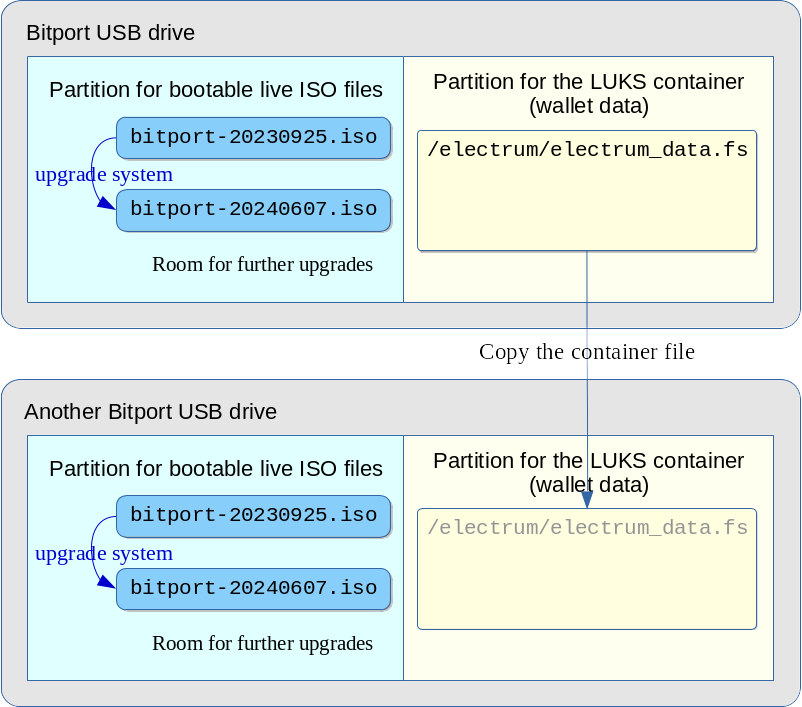

# Security and Maintenance for Bitport

## Security precautions

- While you are building the Debian live system and the Bitport drive you can plug in your Bitport USB drive in the online computer,
  but once Electrum wallets are created you should never plug in the Bitport drive in any online computers.
- For practical use of Bitport you should have corresponding watch-only Electrum wallets on your online computers.
  Refer to the documents for how this works:
  * .
  * .


## What are the passwords you need to manage for using Bitport

To use Bitport you need to manage the following passphrases and passwords.

1. The GPG encryption password for the sha256 checksum for the ISO file verification
2. LUKS volume passphrase\
   This passphrase is the first layer of security so you need to make it very strong.
   The use of diceware with at least 12 words is recommended because the generated passphrase is strong but easy to remember and write down.
3. Electrum wallet passwords\
   For maximum security you should use different passwords for different Electrum wallets.
4. Electrum wallet metadata\
   The metadata items such as the wallet types are not passwords, but important to back up.
5. Electrum wallet metadata GPG encryption passwords\
   If you choose to use the encrypted metadata storage within the LUKS volume you need password for them.
   The importance of the seed word list is the same as the Electrum wallet content,
   so it should be fine to use the same password as for the corresponding wallet in Electrum.


## Passphrase and password strength

You can use any good passphrase generator but we recommend Diceware.

* Diceware passphrases provide good estimate for their entropy.
* They are easier to remember than passphrases consisting of random alphabet and symbol character combinations.
* Less prone to errors because passphrase words are taken from known words.

Diceware is available on all Linux distributions.
[Diceware](http://world.std.com/~reinhold/diceware.html)


## Passphrase and password storage

Our project doesn't have recommendations for how to safely keep these passphrase and passwords.
People have their specific needs and circumstances so it is not easy to make any recommendations.
Also it will be safer in general if we don't talk too much about where the passwords should be stored.


## Maintenance recommendations

We recommend to:
- Keep multiple copies of Bitport devices with the same EDATA content (i.e. wallets data) and place them in multiple locations.
- Add manifest file in the EDATA partition with the USB device series number and the date to track the USB devices.
  It doesn't need to be the real serial number but your own series number.
- Periodically check the software health of the Bitport USB devices on multiple offline computers.
- When a device fails physically or electronically, replace it with a working newly programmed device.
- Periodically update the EDATA content.
- Periodically update the Electrum version in the Debian Live system.
  Note that multiple Debian Live ISO files can coexist in the Boot-ISO partition.
- Write the update status journal.
- Keep track of the device locations in the journal.


## Backups

It is crucial to create backups of your Bitport device so that you can protect your Electrum wallets from electronics failures, damage or loss of devices.

Also flash memory is known to be not too durable.
([Why I'm usually unnerved when modern SSDs die on us](https://utcc.utoronto.ca/~cks/space/blog/tech/SSDDeathDisturbing))

Then backing up Bitport is trivial.
You can create another Bitport USB flash drive and copy the original container file `/electrum/electrum_data.fs` to another device, placing it in the same directory `/electrum/` within the filesystem `EDATA`.

If you run `luks-setup-wallet-dir` on the new Bitport drive and quit the script just before creating a new LUKS container file,
the directory `/electrum/` with the right owner and permissions will be created on the `EDATA` partition.
You can instead manually do the same by making the directory `/electrum/`with the root owner and give the normal permissions.

### How to back up the LUKS container

You need to have:

+ a Bitport USB drive with the working LUKS container file,
+ a new Bitport USB drive which has no LUKS container file yet, and
+ an offline computer which has at least two USB ports.

If you are already using the LUKS volume on the first Bitport USB drive,
you need to un-mount the LUKS filesystem and close the mapped LUKS device before you start backing it up.



If you haven't boot up the Bitport system,
plug in the first Bitport USB drive in the offline computer and boot it and mount the EDATA partition.
The mount point will be `/media/user/EDATA`.

After the Bitport system is booted, plug in the new Bitport USB drive to another USB port and mount its own EDATA partition.
The second EDATA partition will be mounted as `/media/user/EDATA1`.

The owner of `/media/user/EDATA/electrum` and `/media/user/EDATA1/electrum`should be `root`.

Then run the command:
```
sudo cp /media/user/EDATA/electrum/electrum_data.fs /media/user/EDATA1/electrum
```

Un-mount both of the EDATA partitions `/media/user/EDATA` and `/media/user/EDATA1`.
Safely eject the new Bitport drive, plug off the new drive, shutdown the live system and finally plug off the old Bitport device.

Now you have backed up the LUKS container file in another USB drive which is now a working Bitport drive.

You should now make sure the new Bitport device works as intended with the copied LUKS container file.


## References

+ [Electrum official document on cold storage](https://electrum.readthedocs.io/en/latest/coldstorage.html)
+ [bitcoinelectrum.com document on cold storage wallet](https://bitcoinelectrum.com/creating-a-cold-storage-wallet-in-electrum/)
+ [Diceware](http://world.std.com/~reinhold/diceware.html)
+ [Why I'm usually unnerved when modern SSDs die on us](https://utcc.utoronto.ca/~cks/space/blog/tech/SSDDeathDisturbing)

