# Using Bitport USB drive

## Booting Bitport USB drive

After installing the custom Debian Live ISO-9660 image on the multiboot USB drive,
you can start using the drive in an offline setting.

Power on the offline computer with the custom USB drive plugged in a USB port.
Use the function key specific to your computer to choose the USB device as the boot device.

You will be presented with grub menu on the multiboot system to select the ISO image.
After selecting the ISO image file, the computer will reach the Debian Live boot menu.
Just select the first boot option of the Debian Live system.

Note that you can install multiple versions of Bitport live system ISO files with different selections of Debian packages
or different versions of Electrum software.
In this case you can easily select booting any of these ISO image files.
In this way you can try installing your newer build of Bitport ISO image along with the existing working ISO image file
on the USB drive so that you can make sure the new one works as intended.
Otherwise you can switch back to the old ISO image file while you are trying to build a new ISO image again with further modifications.

These steps are all described in the multiboot project documents.

The Bitport system will boot and automatically log in to the account `user` without you needing to type account or password.
The password of the account `user` is `live` in case you need it.
Also sudo command being run by `user` doesn't require its password.


## Helper Applications for Electrum

Applications that manage creation of the LUKS encrypted volume and placing Electrum wallet within the LUKS volume
and so on are available under `internet` of `Applications` menu.

Each of the menu items corresponds to the following wrapper script:

| Menu Application | Wrapper script |
| ------------ | ------------ |
| Display Electrum Wallet Metadata	| `/opt/electrum/wrapper/display-wallet-metadata` |
| Electrum Bitcoin Wallet Wrapper	| `/opt/electrum/wrapper/electrum-offline-wrapper` |
| LUKS Add Passphrase	| `/opt/electrum/wrapper/luks-add-passphrase` |
| Save Electrum Wallet Metadata	| `/opt/electrum/wrapper/save-wallet-metadata` |
| Setup LUKS for Electrum data directory	| `/opt/electrum/wrapper/luks-setup-wallet-dir` |
| Verify SHA256 checksum of the Debian live-build System	| `/opt/electrum/wrapper/verify-checksum` |


## Verify SHA256 checksum of the Debian live-build System

First it is best to verify the checksum of the Live system before you start using Electrum.

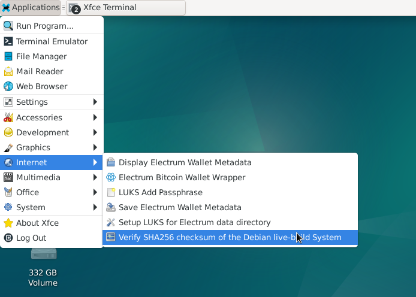

This menu item will run the script `/opt/electrum/wrapper/verify-checksum`.

The script will read the current kernel boot parameters to detect the ISO-9660 file name out of which the current live system booted,
pick up the encrypted checksum file that corresponds to the ISO file name,
ask the user for the GPG passphrase to decrypt it,
change the current directory to /run/live/medium,
and compare the directory content against the decrypted checksum.

If you haven't mounted the EDATA partition yet, it will show a message encouraging it.

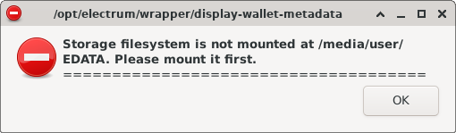

So mount the EDATA partition shown on the desktop.

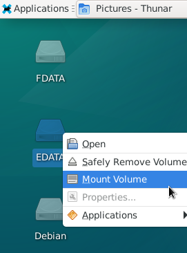

Once the verify application starts it will show the list of files it has finished checking.

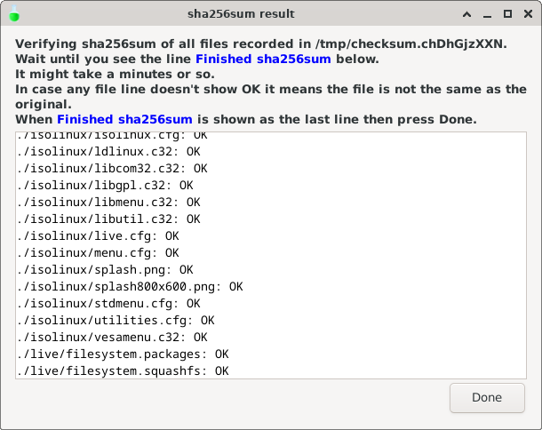

It will take a little more than a few seconds to complete:

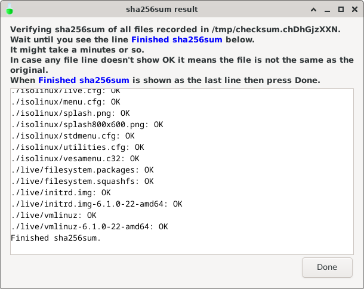

Scroll down the list of checksum comparison to its bottom.
When you made sure the checksum result reports no problem, you can close the dialog, and it will show the final message.

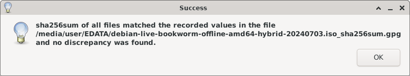


## Setup LUKS for Electrum data directory

Let's create an encrypted LUKS volume in the EDATA partition and the wallet directory in there.
You need to finish this step to be able to start using Electrum.

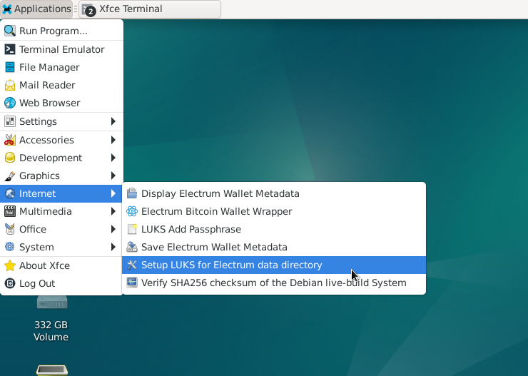

This menu item will run the script `/opt/electrum/wrapper/luks-setup-wallet-dir`.
It will allocate the container file `/electrum/electrum_data.fs` in the `EDATA` partition,
and create a LUKS encrypted filesystem within the file.

The security of the LUKS volume directly depends on the strength of the LUKS passphrase,
so take your time to decide the strong password and remember to keep it safe and secure somewhere.

First the script will present a dialog asking you for the size of the LUKS container file.
The size of around 100 MiB should be very accomodative for Electrum wallets storage
unless you store other items than Electrum wallets in the same LUKS volume.

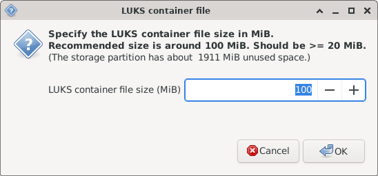

You can see the logging items so far.

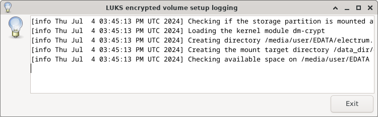

You need to confirm the size you specified in the previous dialog.

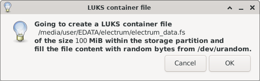

It will present how you can decide the LUKS passphrase and type it in the next dialog.
As the dialog notes it is very important to keep your passphrase on some safe media (such as paper) in multiple secure locations.

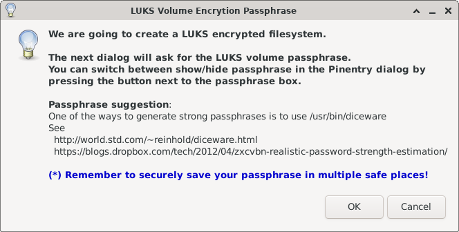

You are presented with a Pinentry dialog for typing in your passphrase.
You can switch between hide/show for the passphrase by pressing the abc button next to the PIN box.

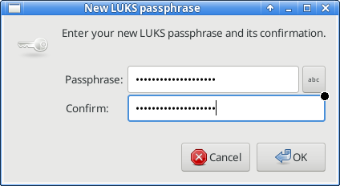

Here is how it appears if you press the abc button.

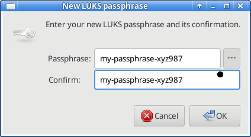

The next message is to tell you that it will take more than a few seconds to format the LUKS device.

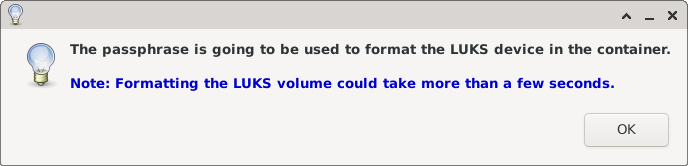

When formatting is done it will show this message.

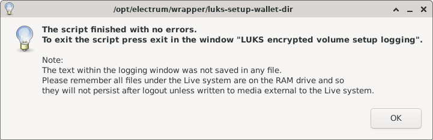

You will have more log items in the logging box.

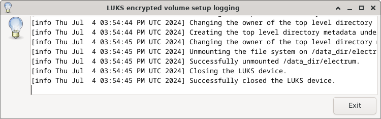

The logging will show that the script has created the LUKS container
`/media/user/EDATA/electrum/electrum_data.fs`,
formatted it with LUKS and created the ext2 filesystem on it,
then mounted its filesystem at `/data_dir/electrum`,
and created the directory `.electrum` under it.

You can see the generated container file in the file manager.

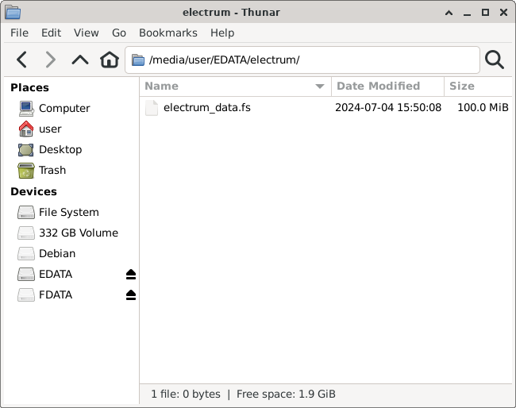


## Electrum Bitcoin Wallet Wrapper

Now you can run Electrum.

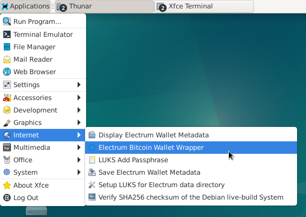

This menu item will run the script `/opt/electrum/wrapper/electrum-offline-wrapper`.

The script will open the LUKS volume and mount it at `/data_dir/electrum` before running Electrum.
The actual command that runs Electrum within the wrapper script is:
```
run_electrum --offline --dir=/data_dir/electrum/.electrum
```

So the wallet data is placed in the directory `/data_dir/electrum/.electrum/` which is on the filesystem stored in the LUKS volume container file `/electrum/electrum_data.fs`.

You need to type in your LUKS passphrase first.

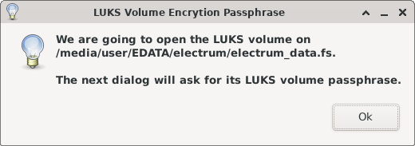

The same Pinentry dialog, where you can toggle hide/show status.

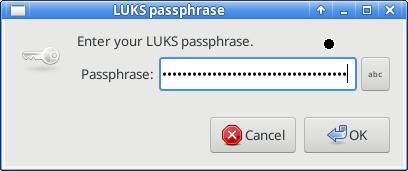

Now Electrum application has started.

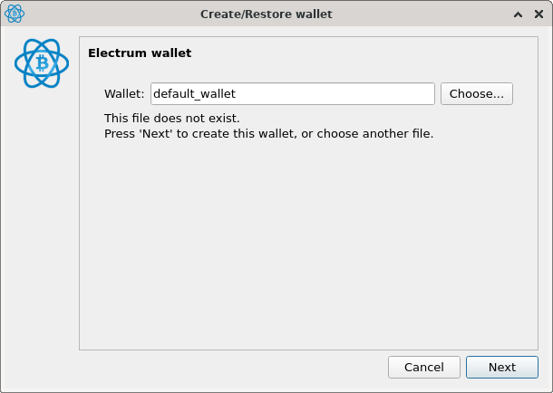

There is a set of restrictions with the offline Electrum wallet
in that anything related to the network connection is disabled.
You cannot look up the bitcoin balance of your addresses or transaction history, you cannot send transactions to the network.
The only use of the offline wallet is to sign the transactions created on online wallets.

User scenario : You create a transaction on the online Electrum wallet,
export the transaction to a file, copy it to a USB memory,
mount the USB memory on the offline machine that is running Bitport,
start the offline Electrum on the offline machine,
import the yet-to-be-signed transaction from the file on the USB memory within the offline Electrum,
sign the transaction with the private key there,
export the signed transaction to a file,
copy the file to the same USB memory,
mount the USB memory on the online Electrum,
load the signed transaction on the online Electrum and then broadcast it to the Bitcoin network.

By the way you can see the actions of the wrapper script in the log window.
You can always manually save it to a file and copy it to non-live system.
The logging is to make sure the script is functioning as intended, and there is no logging for what Electrum is doing.
The actions you take with the offline Electrum can be recorded in the description field of the corresponding transactions on the online Electrum.

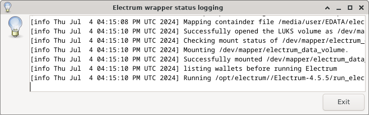

Initially Electrum will prompt you to create a new wallet.
You would want to use some other name than default_wallet for your wallet:

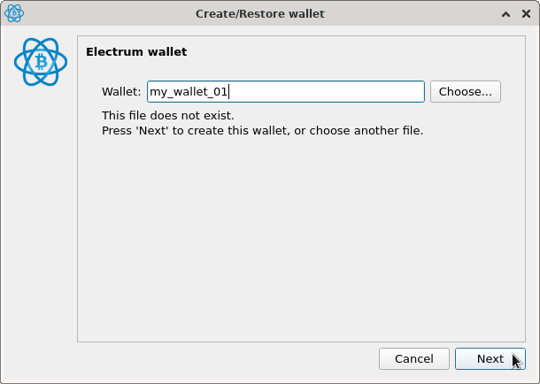

If you press Next after deciding on the wallet name you are given options for wallet types:
In this case we use Standard wallet.

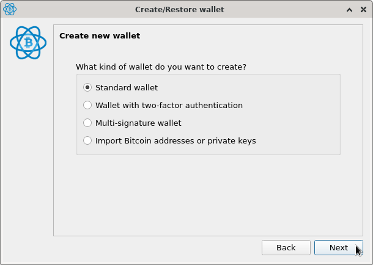

Next dialog is for the wallet seed word list.

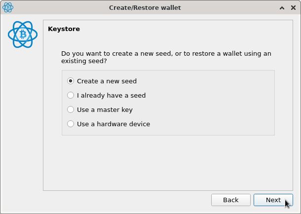

If you select "Create a new seed" it will randomly generate a list of seed words.
You are strongly encouraged to save the seed word list in a secure way in multiple locations.

Our Electrum wrapper script later allows the user to save the seed in a GPG encrypted file within our LUKS volume,
so it is one of the options you can use.
One of its disadvantages is you have to manage one more password for the GPG encryption,
but you can use the same password as for the corresponding Electrum wallet to make it easier if you need to.

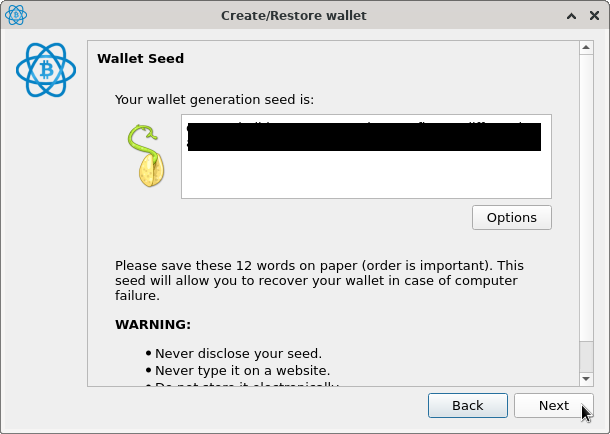

You need to type in the same sequence of the seed words to make sure you have saved it somewhere safely.

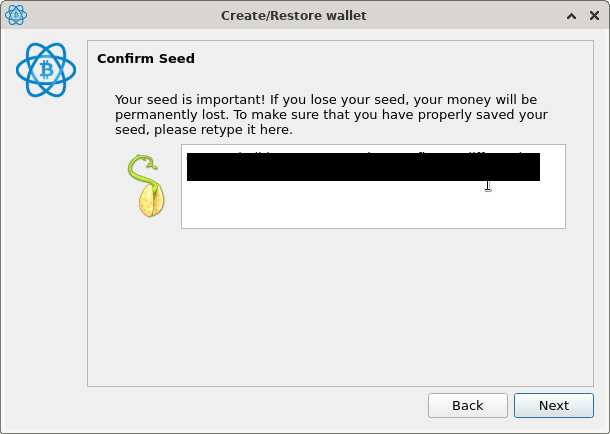

It is best to encrypt the wallet data with the password.

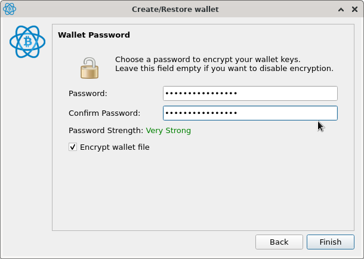

You cannot check the Electrum update status because the system is offline.
You can turn on update notification on your online Electrum instead.

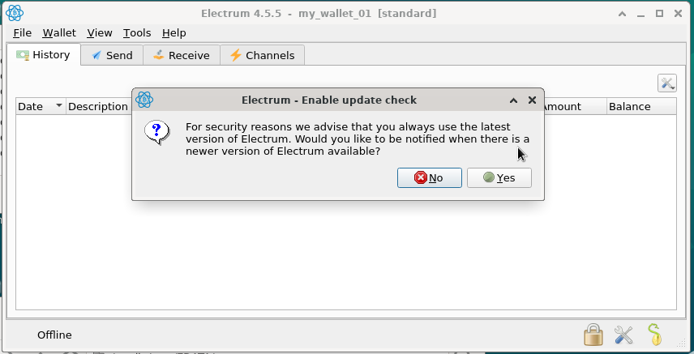

Because this system is offline forever there is no point in saving transactions.
You can always save transactions data on your online Electrum that accompanies your offline wallet.

Press No to the update check dialog and now here is vanilla Electrum with no transaction.

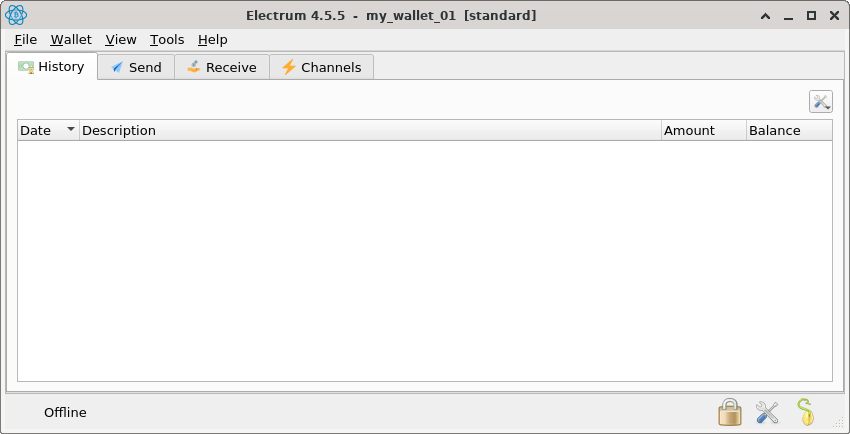

There are good (but a little old) documents for how to organize an online watch-only Electrum wallet together with the offline Electrum wallet:

* [electrum official document on cold storage](https://electrum.readthedocs.io/en/latest/coldstorage.html).
* [bitcoinelectrum.com document on cold storage wallet](https://bitcoinelectrum.com/creating-a-cold-storage-wallet-in-electrum/).
* [cold storage wallet](https://en.bitcoin.it/wiki/Cold_storage).


Now exit Electrum to see what the wrapper script offers for saving wallet metadata.

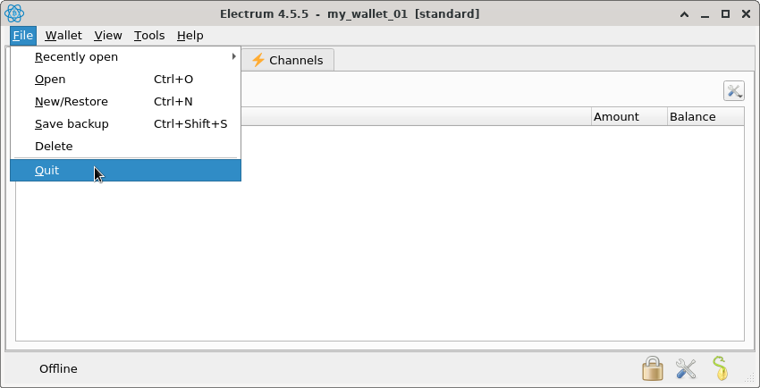

Electrum wrapper script now presents you to save the metadata for the Electrum wallet you created.

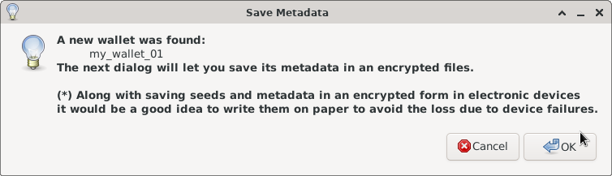

You need to remember these items for your wallet.
The script doesn't store the Electrum wallet password in the metadata file.

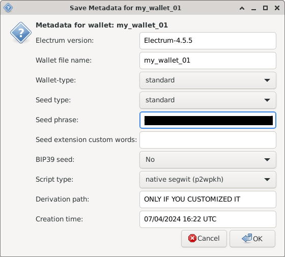

The suggested file name should be good, otherwise you can customize it.

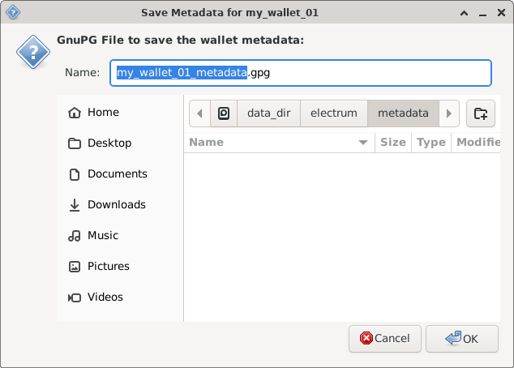

Explanation of the GPG passphrase required to encrypt wallet metadata file.
The GPG command that the script uses is `echo -En "${metadata_content}" | gpg --symmetric --output "${wallet_metadata_path}"`.
`${wallet_metadata_path}` is a file under the directory `/data_dir/electrum/metadata`.

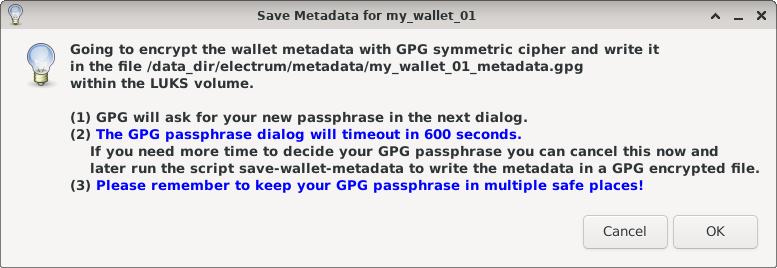

Pinentry dialog for the GPG passphrase.
If you press the little box on the right with the label abc the passphrase you enter will be visible.

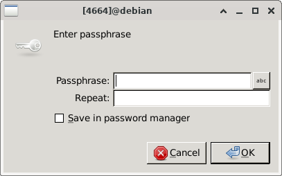

When you press the OK button to the pinentry, the filesystem on the LUKS volume will be un-mounted and the LUKS volume will be closed.

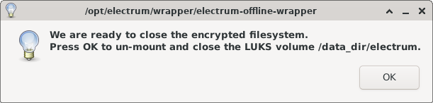

Note about logging window.

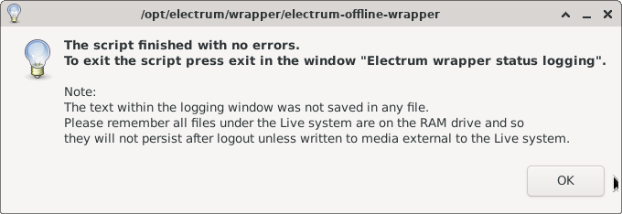

Electrum wrapper logs.

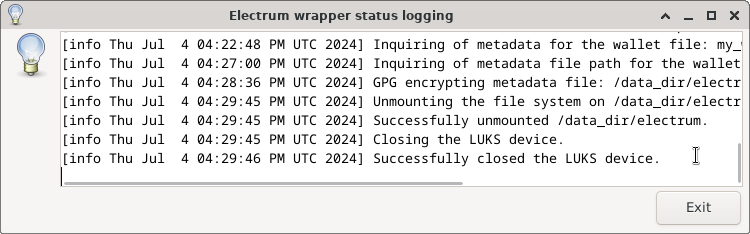


## Save Electrum Wallet Metadata

In case you skipped saving the wallet metadata and exited the Electrum wrapper script
but you decide later that you want to save the metadata,
you can do so by running the script `save-wallet-metadata`.

Also you can display the wallet metadata without running Electrum itself
by running the script `display-wallet-metadata`.


## Display Electrum Wallet Metadata

The script `display-wallet-metadata` will let you look up the wallet metadata.
As other script it decrypts the LUKS volume and mount it at `/data_dir/electrum`,
presents a dialog to choose the specific metadata file within the directory `/data_dir/electrum/metadata`,
ask for its GPG passphrase and decrypt the file to show its content.


## LUKS Add Passphrase

The script `luks-add-passphrase` will let you add a new LUKS passphrase in an additional keyslot.
It calls the command `cryptsetup luksAddKey /electrum/electrum_data.fs`.


## References

* [Electrum official document on cold storage](https://electrum.readthedocs.io/en/latest/coldstorage.html).
* [bitcoinelectrum.com document on cold storage wallet](https://bitcoinelectrum.com/creating-a-cold-storage-wallet-in-electrum/).
* [Cold storage wallet](https://en.bitcoin.it/wiki/Cold_storage).
